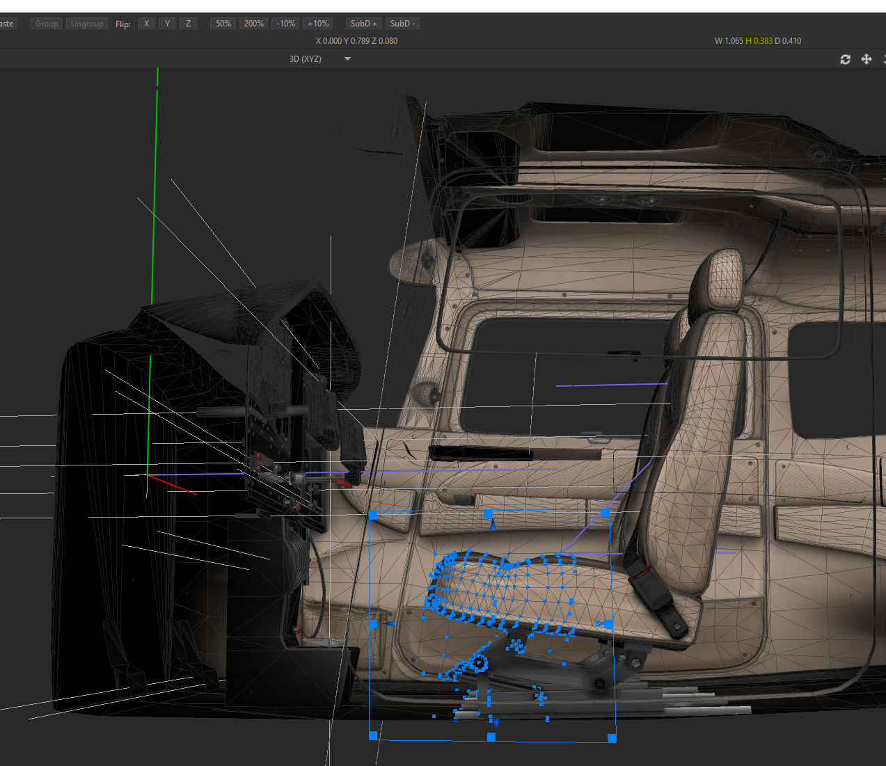

import toggle from "./arduino-toggle.mp4"

## Motivation

When I was taking flying lessons, it seemed like a good investment to set up a flight sim for practice at home. A copy of X-Plane 11 and a Saitek yoke and rudder were enough to give me a good feel for the rudder (I was really afraid of going into a spiral, so I was too gentle on it in the air). Adding an HTC Vive VR headset helped with attitude awareness, and referencing the ground for the landing pattern. Still, the throttle wasn't realistic enough to get the hang of approach, and using the VR wand was really annoying for practicing anything with switches. 

Any pre-build cockpits that had realistic throttle and switches were going to be in the $1000's. On the other hand, a real throttle and mixture control were just a couple hundred bucks, and I've always wanted to solder together something useful :)

## The Build
### Implementation details
See the [GitHub repo](https://github.com/vlad-nestorov/flight-sim) for a full part list, measurements and other details.

###  Materials

Cheap but realistic enough with a VR headset on is what we are going for. The frame is lumber and plywood (~$20). The controls are the simplest switches with a similar feel, hooked up to an Arduino board ($125). The crowning jewels are the real throttle and mixture controls, which cost more than the other parts combined at $280. 

I'm excluding the cost of the other things I already had before starting this project: X-Plane license, Saitek Yoke+Rudder, VR headset, a graphics card that can handle it.

### Getting the cockpit dimensions

When I have my VR headset on, I still need to reach for physical switches, so it becomes important that where I see the switch in VR is where it is in reality. Luckily, we can look at X-Plane object models using an [AC3D plugin](https://developer.x-plane.com/tools/ac3d-plugin/) Thankfully the coordinates are in meters, so it was pretty easy to get relative distances between things. 

### Hooking up the Arduino
<video autoPlay muted loop >
  <source src={toggle} />
</video>

Arduino provides a Joystick library, which makes it pretty easy to make physical switches become joystick buttons. One challenge was configuring X-Plane. For most things there are ON, OFF and TOGGLE bindings corresponding to a button push event, so if I were to treat my toggles as a button, I'd only be able to use the TOGGLE binding, which would mean my initial state in X-Plane might not match the physical toggle switch. So, I pretend each toggle is actually two buttons (an off button and on button). That way when I first initialize, I can "push" the joystick button corresponding to the correct physical state. 

The slide potentiometers had to be long enough to allow full travel of the throttle and mixture controls, and it was a pain to get the two attached. After that it was really easy to set them up as axis controls in the joystick library.

### Building the frame

My first iteration of the frame had the rudder pedals sitting on the ground. Since I wanted the rudder pedal and yoke to have the same distance between them as measured from the cockpit, the whole set up ended up being too close to the ground. Now, if used Cessna seats were cheaper, I might have a cooler set up. Instead I settled for creating a little platform for the rudders and sticking with my office chair. 

### Putting it all together

The final challenge after all the components were hooked up was aligning the position in VR space to match my physical position. X-Plane uses the physical position of the VR headset and centers it where the pilot's head would be. That works great when you're using just a yoke and rudder, but breaks down pretty quickly when you try to look down and reach for a small switch. The key here is having a consistent place you can put the VR headset in, with millimetre precision. The top of the yoke fit that bill. With a lot of fiddling, I was able to tell X-Plane that my pilot's head actually belongs in the engine compartment, so that after the game sets up with my headset down, I can pick it up and all the controls look in the right place. 

# Was it worth it?
Yes. This set up has really helped me get a feel for slow flight and approaches, both things that require precise throttle control. I was also able to set up a checklist plugin with my flight school's checklists, so practicing a full run from engine start, to engine stop feels very realistic.